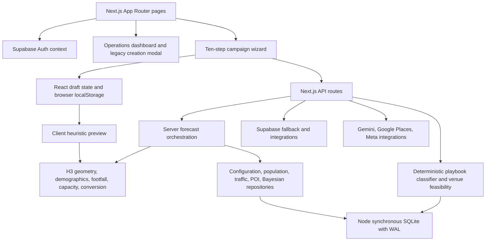

# Ziggers Execute: architecture, engine and campaign UX review

Reviewed 2 October 2026, starting from `main` at `6637460`. Changes are local and have not been pushed.

Follow-up: verified cleanup has since removed 18 files and added shared geometry caching. See [safe-cleanup.md](safe-cleanup.md) for current counts and verification. The original findings below describe the initial audit; original benchmark snapshots remain available.

## Assessment

This is a substantial working planning application with useful domain modules, rather than merely a landing page. The strongest parts are the separation of forecasting stages, explicit staffing constraints, schedule validation, audit primitives, and deterministic playbook routing. It is not yet an evidence-validated prediction system or a production-ready campaign/payment platform. Passing arithmetic and routing tests does not establish real-world conversion accuracy, security, or genuine escrow protection.

The review traced application entrypoints, imports, campaign creation/persistence, forecast stages, playbooks, data repositories, auth boundaries, test setup, and all ten campaign screens. It is not an exhaustive security audit of every endpoint or a production load test. No campaigns were published and no payment flow was exercised.

## Architecture

| Area | Responsibility and observations |
|---|---|
| `src/app` | Marketing pages, authentication, dashboards, campaign routes and HTTP APIs. Next.js 16.2.12, React 19.2.4. |
| `src/components/campaign-creator` | Ten-step wizard, summary, forms, maps, vendor and analysis dialogs. State and derived calculations are concentrated in `CampaignCreationLayout.jsx`. |
| `src/components/dashboard` | Campaign monitoring, workforce, proofs, finance, signal sync, and data management. A separate 947-line campaign modal is still reachable from a dashboard action. |
| `src/lib/intelligence` | H3/Turf geometry → demographic/interest fit → footfall → staffing → physical funnel → conversion → uncertainty/score. Also schedule, verification, attribution and learning. |
| `src/lib/intelligence/clientForecast.js` | Browser preview with fixed geographic/population assumptions. It does not read tenant posteriors or local database evidence. |
| `src/lib/intelligence/index.js` | Server orchestration with repository reads and a forecast snapshot insert on every call. Computation and persistence are coupled. |
| `src/lib/intelligence/playbook` | Keyword/product journey classification, playbook retrieval, venue feasibility and recommendation snapshots. Optional Gemini explanation is in the API layer; it is not a trained predictive model. |
| `src/lib/data` | The active `getDatabase()` implementation is synchronous `node:sqlite`, despite its opening comment mentioning PostgreSQL. Schema, migrations and defaults are embedded in a 934-line file. |
| `src/lib/marketplace` | Requirements, RFQ, work orders, readiness; manpower/logistics/settlement have tests but no active Next.js import path. |
| `supabase` | Separate SQL migrations and edge functions. There are two persistence/schema paths to keep aligned. |
| `src/domain`, `src/services`, `src/state`, `src/ui` | Partially disconnected typed architecture. Some types/services remain reachable, but the standalone UI tree is not mounted by Next.js. |
| `ml_service/model_contract.py` | Python model contract, not evidence of a deployed/trained ML service. No integration reference was found in the searched app/test/package files. |

## Engine efficiency: measured results

Node v24.14.1, local machine, 20 serial measured calls per case after an initial call. The server benchmark uses a separate SQLite file and includes forecast inserts. These figures exclude HTTP, external APIs and concurrent users. Machine contention was higher in the first run; do not treat cross-run server timing changes as an optimization result.

| Calculation | Radius | Before cache median | After cache median | After cache p95 |
|---|---:|---:|---:|---:|
| Client preview | 0.5 km | 72.82 ms | 0.17 ms | 0.29 ms |
| Client preview | 3 km | 540.14 ms | 0.21 ms | 0.31 ms |
| Client preview | 8 km | 551.69 ms | 0.32 ms | 0.47 ms |
| Server forecast, unchanged | 3 km | 905.15 ms | 343.87 ms | 395.47 ms |

The added cache reuses the population geometry aggregate for the same radius, capped at 24 entries. It caches neither whole forecasts nor user-specific values. Budget, audience, objective and schedule calculations still run. The first 3 km preview calculation still took 488.69 ms, so a worker or asynchronous server calculation remains worthwhile. This is a warm repeated-call improvement, not an end-to-end page speed claim.

The staffing search is bounded to 200 promoter counts and is inexpensive. Polygon intersection is the major obvious CPU cost: each radius generates H3 candidates and runs Turf intersections. Server geometry and synchronous SQLite block the Node event loop. Forecasts also write snapshots even when called for ranking or inspection, increasing database growth and write contention.

Raw evidence: `engine-benchmark-before-cache.json`, `engine-benchmark.json`. Reproduce with `node scripts/benchmark-engine.mjs`.

## Accuracy and correctness findings

1. **Fixed geography and incomplete multi-location calculation.** The browser preview uses Chennai coordinates regardless of the selected city. The server primarily uses `targetLocations[0]`; population aggregation repeats a single base-cell population across intersecting cells. These are not independently measured populations for each cell or a deduplicated multi-location campaign forecast. Resolve actual coordinates, load every cell's population, and union overlapping areas before aggregation.
2. **Preview argument mismatch, fixed in this change.** The preview passed `basePopulation` to a function expecting `totalPopulation`, so the displayed audience and downstream demand could disagree. It now passes the correct population, objective and schedule start hour.
3. **Zero staffing fallback, fixed.** `expectedInteractions || 1000` turned a legitimate zero into a positive capacity. It now preserves zero. Added a zero-budget regression test.
4. **Confidence is overstated.** Server confidence can become `HIGH` after any observation, and defaults include 0.90 confidence and fixed source snapshot IDs. Population repositories themselves identify seed rows as unverified. The preview now identifies itself as `HEURISTIC_PREVIEW / LOW`; the server still needs confidence derived from actual coverage, sample size, freshness and measured calibration.
5. **Missing spatial data does not reliably reach nearest-node fallback.** `getSpatialPopulationByH3()` returns a truthy `DATA_UNAVAILABLE` object; `getSpatialPopulationByH3(...) || findNearestSpatialNode(...)` therefore skips the intended fallback. Later `base_population || ... || 18500` can mask the absence again.
6. **Campaign payload and persistence disagree.** The wizard sends `ageRange`, location-specific radius, `productOrService`, `promoterCount` and `status: DRAFT_READY`. POST reads `ageMin/ageMax`, top-level `radiusKm`, `product`, `workers`, and `body.stage || 'Live'`. The forecast invocation also omits the resolved tenant ID. A submitted draft can therefore be calculated with different inputs and stored as Live. Use one validated campaign schema shared by client and API; distinguish draft creation from activation.
7. **Edit flow contract is broken.** The edit page requests `/api/campaigns?id=...` and expects `data.campaign`; GET returns the campaign list and does not handle `id`. The wizard also uses POST for submission. Implement explicit single-campaign GET and update endpoints and persist the complete editable draft.
8. **Persistence is not atomic.** The forecast function writes one snapshot, then campaign POST separately inserts a campaign and another snapshot. There is no encompassing campaign transaction. Remove side effects from calculation and save the campaign plus linked prediction once in a transaction with an idempotency key.
9. **Playbook fallback invents operational facts.** Recommendation fallbacks contain `permission_status: 'APPROVED'`, capability values, and fixed quotes for suggested venue types. Even with `isVerifiedVenue: false`, feasibility can consume those invented facts. Missing permission, access and quotation information should remain unknown and prevent automatic approval.
10. **Real predictive accuracy is unmeasured here.** The code contains WAPE/MAE/RMSE, interval coverage and temporal holdout helpers, but no representative held-out verified campaign dataset was evaluated in this review. There is no defensible “100% precision” conclusion from these tests.

## Highest-priority production risks

| Priority | Finding | Action |
|---|---|---|
| Critical | Campaign API handlers accept request-supplied tenant IDs; no server session verification is present in those handlers. GET's Supabase fallback does not apply a tenant filter. DELETE includes tenant-wide deletion. Client dashboard redirects do not protect APIs. | Verify identity server-side, derive tenant membership from session, authorize every read/write/delete, and test cross-tenant HTTP access. |
| Critical | Step 10 presents escrow verification using timer-driven phases and a random hexadecimal identifier. No real payment verification is established by that UI. | Clearly label the simulation; implement provider checkout, signed webhook verification, ledger reconciliation and server-enforced activation gates before claiming protected funds. |
| High | Brand metadata fetch accepts a supplied URL without visible private-network/redirect destination filtering. | Validate scheme and resolved destination, reject private/link-local targets across redirects, bound response size and add timeouts. |
| High | Draft versus Live state and field mapping disagree across wizard/API. | Fix the shared contract before enabling campaign submission in production. |
| High | Server CPU and database operations are synchronous, and SQLite is local to one filesystem. | Benchmark concurrent traffic; use workers for geometry and a deliberate durable multi-instance database strategy when scaling. |
| Medium | Silent `catch` blocks and fallback values obscure missing data and failed snapshot writes. | Structured errors and data-quality flags; show unavailable estimates explicitly. |

These backend findings are documented, not all remediated by this UI-focused change. Financial authorization was not tested or triggered.

## Unused files: defensible count

The static scan found **190 JS/JSX/TS/TSX source files**, **55 Next.js convention entrypoints**, **168 reachable source files**, and **22 source files outside the active app import graph** (11.6% of source files).

| Candidate group | Count | Files |
|---|---:|---|
| Unmounted typed UI | 7 | `src/ui/ActivationForm.tsx`, `App.tsx`, `AudienceSelector.tsx`, `BrandHeader.tsx`, `CampaignDetail.tsx`, `CampaignList.tsx`, `LocationSelector.tsx` |
| Disconnected state/services | 4 | `src/state/appContext.tsx`, `appStore.ts`, `src/services/apiClient.ts`, `campaignService.ts` |
| Domain types outside active routes | 4 | `src/domain/audience.ts`, `brand.ts`, `campaign.ts`, `location.ts` |
| Unused wizard components | 4 | `CapacityFunnel.jsx`, `DataProvenanceModal.jsx`, `IndiaMapPicker.jsx`, `PlaceDiscoveryFilter.jsx` under `src/components/campaign-creator/ui` |
| Test-covered but unwired marketplace logic | 3 | `logisticsEngine.js`, `manpowerEngine.js`, `settlementEngine.js` |

There are also **five public starter SVGs with no references found**: `file.svg`, `globe.svg`, `next.svg`, `vercel.svg`, `window.svg`. These are additional candidates, outside the 22 source-file count. A public asset can be used by an external URL, so absence of repository references is not proof of safe deletion.

No files were deleted. Some candidates are directly or transitively used by tests. The static import scan does not prove runtime non-use through arbitrary string-based imports. SQL migrations, scripts, configuration and tests are not counted as unused merely because the app does not import them. Full paths and direct external references are in `dependency-audit.json`; reproduce with `node scripts/audit-codebase.mjs`.

## Campaign UI/UX changes implemented

- Consistent responsive content grid: primary form plus a 300 px summary at wide desktop sizes; single column below that. The main panel can shrink without pushing the summary out of alignment.
- Summary is sticky and independently scrollable on desktop, collapsed initially on smaller screens with an accessible expand/collapse control.
- A single step-navigation pattern works across screen sizes, with named phases, current-step semantics, numbered buttons and an explicit progress bar. Steps remain editable; visiting a step is no longer represented as proof that it was completed.
- Added basic-details validation before forward navigation and submission: campaign/brand/product names, schedule and positive finite budget. Error messages appear inline and focus returns to the step content.
- Clearer “Next: …” footer actions and screen-reader label for the dashboard link.
- Form controls have consistent 44 px minimum height and 16 px input text, visible keyboard focus, and linked labels for the basic identity/schedule/budget fields.
- Objective cards are real buttons with pressed state and keyboard interaction. Two columns prevent dense three-column text clipping.
- Plain-language opening and budget copy; summary calls forecasts planning estimates and asks users to confirm footfall and costs.
- Draft status identifies device-local saving instead of claiming a draft was autosaved before any write. Autosave is debounced by 500 ms and moved out of the React state updater; storage errors are shown inline.
- Steps 2–10 load on demand rather than all being imported eagerly into the wizard entry module.
- Fixed preview population/capacity behavior and added the bounded geometry cache described above.

## Recommended next UX pass

| Step | Next improvement |
|---|---|
| 1 Basics | Use fresh dates instead of October 2026 defaults; progressively disclose advanced timing metrics; make the primary objective explicit when selecting several. |
| 2 Brand | Reuse the already entered identity, make website analysis optional, replace scraping/taxonomy terminology with familiar labels. |
| 3 Idea | Compare recommended options by expected work, cost, setup time and evidence; distinguish authored ideas from verified outcomes. |
| 4 Audience | Offer a concise recommended audience with an expandable advanced editor; explain what each refinement changes. |
| 5 Locations | Resolve real coordinates, make map/list selection equivalent, show source freshness, permission status and missing information. |
| 6 Requirements | Group by required/optional with quantities and cost implications; preserve user changes when recommendations refresh. |
| 7 Partners | Separate suggested partners from verified/quoted/confirmed partners; provide clear empty and pending states. |
| 8 Workforce | Separate recommended and manually chosen headcount, persist manual overrides, show daily and full-campaign costs side by side. |
| 9 Plan | Make this a review checklist with outstanding blockers and direct links to fix them. |
| 10 Budget | Replace simulated escrow claims with transparent draft/review status until actual payment integration exists. Make one authoritative action follow server validation. |

Also consolidate the legacy dashboard modal into this wizard; it currently provides another implementation to maintain. Namespace drafts by user/tenant/campaign, persist them server-side for cross-device work, and prevent a later automatic recommendation from silently overwriting a user's choices. The save debounce flushes on page hide and component unmount; browser storage still cannot guarantee recovery after a browser crash or storage failure.

## Validation and limits

- Production build succeeded with network access for the configured Google fonts. It produced an existing warning that `playbookImporter.js` causes overly broad file tracing; narrow package discovery paths before deployment.
- Changed React/engine files pass ESLint. Repository-wide lint still reports **36 errors and 5 warnings** outside the cleaned-up change scope.
- Intelligence suite: **79/79 passed**. Marketplace: **30/30 passed**. Production engine: **58/58 passed**.
- Fresh isolated database: playbook checks PB-001 and PB-002 failed because they assume preloaded playbooks. The suite then imported the package. Rerunning against that seeded isolated database passed **14 subtests plus the parent test (15 reported tests)**. Test setup should explicitly seed fixtures before assertions.
- New preview regression tests: **3/3 passed** (zero budget, honest provenance, radius-sensitive reach).
- Browser checks: all ten wizard screens rendered, a blank campaign name blocked forward navigation with an inline message, and refilling the name allowed progress. Desktop 1440×1000 and mobile 390×844 layouts were inspected. This was a UI smoke test, not full end-to-end publication/payment testing.
- Tests used separate SQLite databases; no test fixtures were written to the app's main database. Browser checks used a local demonstration draft only.
- Three older TypeScript test files import Vitest, which is not declared in `package.json` and is not part of `npm test`; consolidate the test runner before treating those as active coverage.

## Suggested implementation order

1. Secure API authentication/tenant authorization and eliminate false payment/permission confirmation.
2. Define one campaign contract; fix save/edit/status mapping and atomic persistence.
3. Share one pure forecasting core between server and client; inject real data and carry missing-data provenance through every output.
4. Move uncached geometry off the browser/main server thread, cache by verified geometry/data version, and load-test concurrent requests.
5. Consolidate the two creation interfaces and complete the per-step UX changes above.
6. Remove or reconnect the 22 unused-source candidates in small reviewed groups; delete starter assets only after checking external usage.
7. Establish reproducible fixtures, passing repository lint, HTTP authorization tests and a verified temporal holdout dataset before making accuracy claims.
